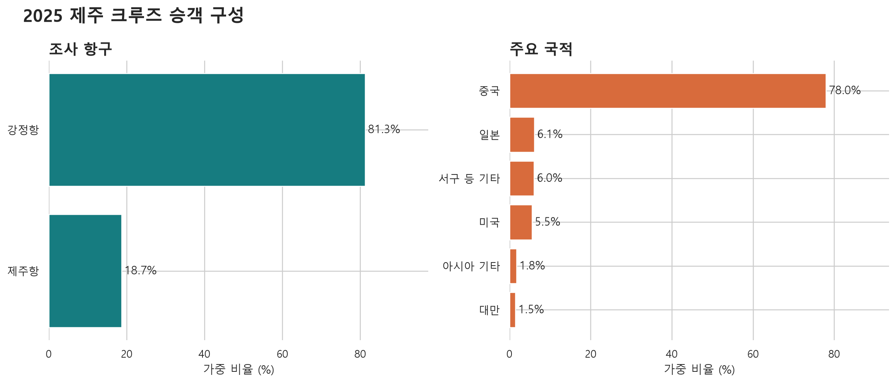
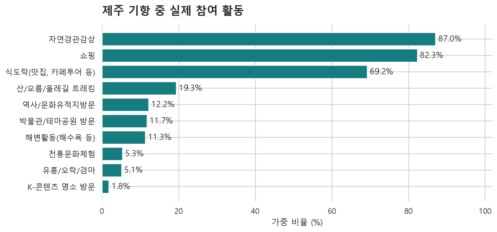
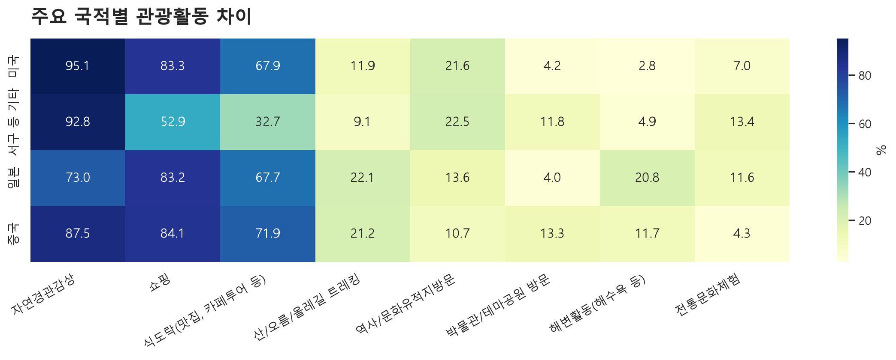
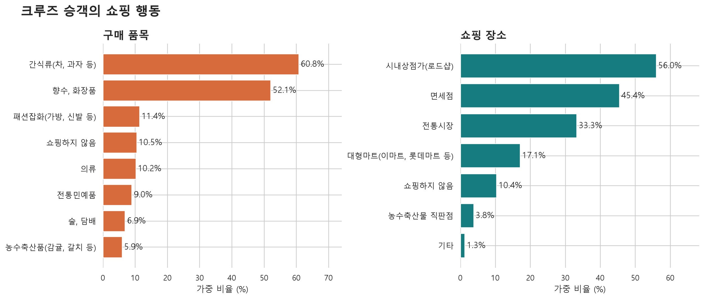
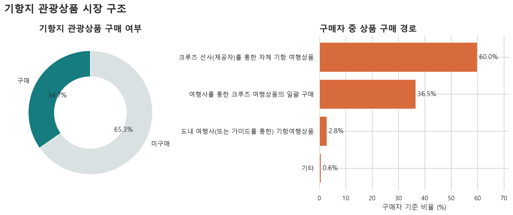
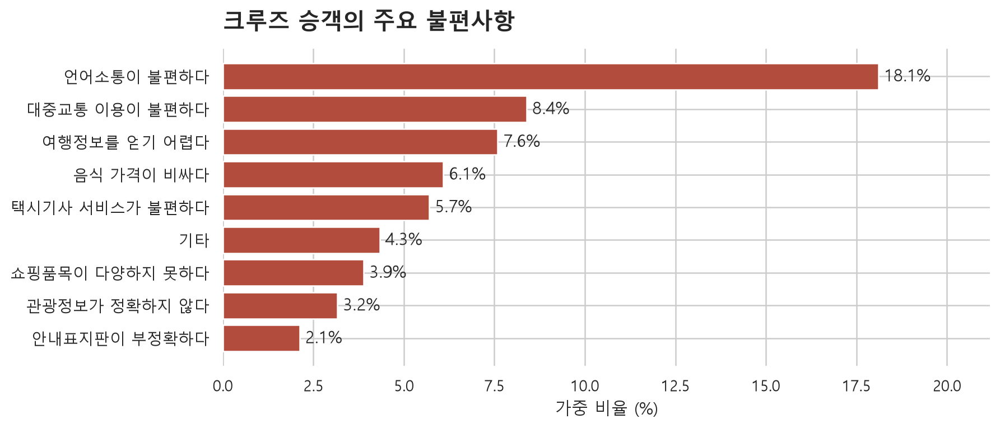

# 2025 제주 크루즈 승객 분석

## 1. 분석 목적

2025년 제주를 방문한 크루즈 승객의 관광시간, 국적, 관광활동, 상품 구매, 쇼핑 및 불편사항을 분석해 짧은 기항시간 안에서 실행 가능한 관광상품 전략을 도출한다.

핵심 질문은 다음과 같다.

1. 크루즈 승객이 제주에서 실제로 관광할 수 있는 시간은 얼마나 되는가?
2. 승객은 제주에서 무엇을 하고 어디에서 소비하는가?
3. 기존 기항지 관광상품은 어떤 경로로 판매되고 있는가?
4. 국적과 항구에 따라 행동 차이가 나타나는가?
5. 날씨 변화에 대응하는 대체 관광상품이 필요한 근거가 있는가?

## 2. 데이터와 분석 기준

- 원자료: `2025 제주특별자치도 방문관광객 실태조사_크루즈_DATA.xlsx`
- 표본: 크루즈 승객 1,014명
- 조사 항구: 제주항, 강정항
- 분석 단위: 응답자
- 가중치: 원자료의 `WT` 적용
- 복수응답 문항: 응답자별 선택 여부를 계산한 후 가중 비율 산출

단순 표본 빈도와 모집단 추정 비율은 다르므로 모든 주요 비율에 조사 가중치를 적용했다. 가중치 합계는 약 752,147이며 실제 입항객 수와 유사한 규모로 확장되지만, 이를 정확한 행정 집계 인원으로 해석해서는 안 된다.

## 3. 핵심 요약

| 지표 | 결과 |
|---|---:|
| 실제 제주 관광시간 | 5.11시간 |
| 1인당 지출경비 | 122.1달러 |
| 전반적 만족 | 90.1% |
| 강정항 비중 | 81.3% |
| 중국 국적 비중 | 78.0% |
| 기항지 관광상품 구매 경험 | 34.7% |
| 자연경관 활동 | 87.0% |
| 쇼핑 활동 | 82.3% |
| 식도락 활동 | 69.2% |

선박의 정박시간과 승객이 육상에서 실제로 관광하는 시간은 다르다. 보고서상 크루즈 승객의 평균 제주 관광시간은 5.11시간이므로, 상품 설계에는 정박시간 약 10시간보다 실제 관광 가능시간을 적용해야 한다.

## 4. 승객 구성

### 항구별 구성

- 강정항: 81.3%
- 제주항: 18.7%

대부분의 크루즈 수요가 강정항에 집중되어 있어 강정항 출발 상품이 우선순위다. 다만 제주항은 면세점 이용률이 상대적으로 높아 별도의 쇼핑형 상품 구성이 가능하다.

### 국적별 구성

- 중국: 78.0%
- 일본: 6.1%
- 서구 등 기타: 6.0%
- 미국: 5.5%
- 아시아 기타: 1.8%
- 대만: 1.5%

중국어 대응이 기본 수용요건이지만 일본어와 영어권 상품을 동일하게 구성할 필요는 없다. 중국 승객은 자연경관, 쇼핑, 식도락을 함께 소비하는 복합형이며 서구권은 자연경관과 역사·전통문화의 상대적 중요도가 높다.

> 주의: 이 국적 비율은 2025년 제주 크루즈 응답자 전체의 구성이다. 선박별 국적 비율이나 특정 선박의 승객 구성을 직접 증명하지 않는다.

## 5. 실제 관광활동

주요 활동은 다음과 같다.

| 활동 | 가중 비율 |
|---|---:|
| 자연경관 감상 | 87.0% |
| 쇼핑 | 82.3% |
| 식도락 | 69.2% |
| 산·오름·올레길 트레킹 | 19.3% |
| 역사·문화유적 방문 | 12.2% |
| 박물관·테마공원 | 11.7% |
| 해변활동 | 11.3% |
| 전통문화체험 | 5.3% |

자연경관 감상은 압도적인 핵심 활동이다. 이는 제주 크루즈 상품이 비와 강풍에 취약할 가능성이 크다는 뜻이다. 반면 현재 실내 대체활동으로 볼 수 있는 박물관·테마공원 참여율은 11.7%에 그친다.

따라서 기상 악화 시 단순 취소보다 다음 구조가 적합하다.

- 맑은 날: 자연경관 + 해안 + 쇼핑/식도락
- 비 오는 날: 미디어아트·박물관·아쿠아리움 + 쇼핑/식도락
- 강풍일: 해안 체류를 줄이고 실내 체험과 로컬 F&B 확대

## 6. 국적별 활동 차이

### 중국 승객

- 자연경관: 87.5%
- 쇼핑: 84.1%
- 식도락: 71.9%
- 트레킹: 21.2%

중국 승객을 쇼핑 단일 유형으로 설명해서는 안 된다. 자연경관이 가장 높고 쇼핑과 식도락이 함께 결합된 형태다. 따라서 중국어 상품은 `자연경관 + 쇼핑 + 식사`의 세 요소를 기본으로 설계하는 것이 적절하다.

### 일본 승객

- 쇼핑: 83.2%
- 자연경관: 73.0%
- 식도락: 67.7%
- 언어소통 불편: 27.7%

일본어 안내와 정확한 방문지 정보가 중요하다. 쇼핑 비중이 높지만 관광정보의 정확성과 정보 획득도 주요 불편으로 나타난다.

### 서구권 승객

- 자연경관: 92.8%
- 쇼핑: 52.9%
- 식도락: 32.7%
- 역사·문화유적: 22.5%
- 전통문화체험: 13.4%

서구권에는 쇼핑 일변도보다 자연·역사·전통문화 해설을 강화한 소규모 코스가 적합하다.

## 7. 쇼핑 행동

### 구매 품목

- 간식류: 60.8%
- 향수·화장품: 52.1%
- 패션잡화: 11.4%
- 의류: 10.2%
- 전통민예품: 9.0%
- 쇼핑하지 않음: 10.5%

### 쇼핑 장소

- 시내상점가·로드숍: 56.0%
- 면세점: 45.4%
- 전통시장: 33.3%
- 대형마트: 17.1%

크루즈 소비가 면세점에만 집중된다고 보기 어렵다. 로드숍과 전통시장 비중도 높기 때문에 항구-상권 셔틀, 다국어 결제 안내, 정액 바우처를 결합할 여지가 있다.

항구별로 보면 제주항은 면세점 54.6%, 강정항은 전통시장 36.3%로 상대적 차이가 나타난다. 제주항에는 면세 쇼핑 중심, 강정항에는 서귀포 시내상권·전통시장·식도락 중심 구성이 더 적합하다.

## 8. 기항지 관광상품 구매 구조

기항지 관광상품 구매 경험은 34.7%다. 구매자만을 기준으로 구매 경로를 다시 계산하면 다음과 같다.

- 크루즈 선사 자체 상품: 약 60.0%
- 여행사를 통한 크루즈 상품 일괄 구매: 약 36.5%
- 제주 현지 여행사·가이드 상품: 약 2.8%
- 기타: 약 0.6%

전체 승객의 약 65.3%는 기항지 관광상품을 별도로 구매하지 않았다. 또한 구매가 발생하더라도 현지 사업자와 직접 연결되는 비중은 매우 낮다.

이는 GetYourGuide 같은 OTA 상품을 분석할 이유가 된다. 다만 OTA의 리뷰 수나 노출 순위를 실제 예약량·매출로 해석해서는 안 된다. OTA 자료는 가격, 코스, 언어, 소요시간, 항구 복귀보장, 취소정책 등 현재 상품 공급구조를 분석하는 용도로 사용한다.

## 9. 불편사항

- 불편사항 없음: 57.6%
- 언어소통 불편: 18.1%
- 대중교통 불편: 8.4%
- 여행정보 부족: 7.6%
- 음식가격 부담: 6.1%
- 택시 서비스 불편: 5.7%

전체 만족도는 높지만 언어, 이동, 정보 문제가 남아 있다. 특히 크루즈 승객은 평균 관광시간이 5.11시간에 불과하므로 작은 이동 지연도 관광과 소비 가능시간을 크게 줄일 수 있다.

상품에는 다음 기능이 필요하다.

- 중국어·일본어·영어 안내
- 항구 픽업 및 정시 복귀 보장
- 방문지별 예상 체류시간 표시
- 악천후 시 실내 코스 자동 전환
- 취소가 아닌 대체상품 선택권
- 식사·쇼핑 바우처의 사전 결제

## 10. 최종 전략 제안

### 전략 1. 5시간 기준 상품 설계

정박시간이 아니라 평균 관광시간 5.11시간을 기준으로 설계한다. 왕복 이동, 승하선 및 출항 전 여유시간을 고려하면 관광지 체류에 쓸 수 있는 시간은 더 짧다.

### 전략 2. 날씨 대응형 트윈 상품

동일 가격대에서 `야외형 A코스`와 `실내형 B코스`를 동시에 구성하고 출발 2~4시간 전 기상조건에 따라 전환한다.

### 전략 3. 항구별 차별화

- 제주항: 면세점·도심 로드숍·식도락
- 강정항: 자연경관·서귀포 전통시장·실내 문화시설

### 전략 4. 국적별 언어와 콘텐츠 조정

- 중국권: 자연경관 + 쇼핑 + 식도락
- 일본권: 쇼핑 + 식도락 + 정확한 일본어 관광정보
- 영어권: 자연경관 + 역사·문화 해설 + 소규모 체험

### 전략 5. 현지 판매채널 강화

현지 여행사·가이드 상품 구매 비중이 구매자의 약 2.8%에 불과하므로 선사 제휴, OTA 노출, 항구 QR 판매, 정시 복귀보장을 통해 현지 상품의 신뢰를 높인다.

## 11. 해석 시 주의사항

1. 본 조사는 표본조사이므로 `WT` 가중치 적용 결과를 사용해야 한다.
2. 복수응답 비율은 합계가 100%를 초과한다.
3. 국적과 활동 간 관계는 상관관계이며 개인의 선호를 확정적으로 예측하지 않는다.
4. 선박별 국적 구성은 이 데이터만으로 확인할 수 없다. 선박별 분석에는 입항 스케줄과 선박별 승객 자료가 추가로 필요하다.
5. 122.1달러는 설문 기반 1인당 지출경비이며 카드매출 실측치가 아니다.
6. 기상에 따른 행동 변화는 이 조사만으로 인과 추론할 수 없다. 입항일·시간대별 기상자료와 결합해야 한다.

## 12. 산출물

- 분석 스크립트: `../analyze_cruise_2025.py`
- 차트: `01`~`06` PNG 파일
- 집계표: 항구, 국적, 활동, 쇼핑품목, 쇼핑장소, 불편사항 CSV
