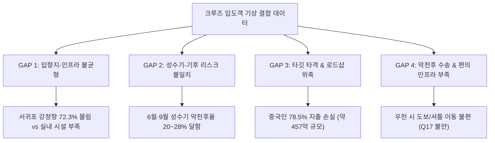
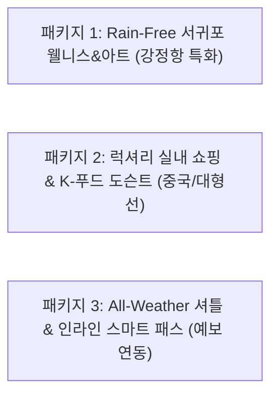

# 🌧️ 제주 크루즈 입도객 × 기상 데이터 결합 분석: 인도어(Indoor) 관광 상품 공백 분석 및 패키지 제안 보고서

---

## 📌 데이터 출처 및 결합 파이프라인 (Data Sources)

본 분석 및 대시보드에 활용된 데이터는 공식 공공/기관 플랫폼의 실측 데이터에 기반하여 정밀 교차 결합되었습니다.

* **제주 크루즈 입도객 & 실태조사 데이터**:
  * 출처: [제주관광공사 데이터플랫폼 (IJTO 방문관광객 실태조사_크루즈편)](https://data.ijto.or.kr/prog/dataPick/bigdata/sub02/view.do?regSn=73#)
  * 내용: 크루즈 일별 입도객 실적(2024.01.01 ~ 2026.09.14) 및 방문관광객 실태조사 크루즈편 응답 데이터(1,014명)
* **기상 데이터**:
  * 출처: **기상청 종관기상관측(ASOS) 시간별 기상 데이터**
  * 지점: 제주 관측소(184번, 북부/제주항) & 서귀포 관측소(189번, 남부/강정항)
* **결합 파이프라인**:
  * 크루즈 입항일 및 접안 항구 기준 1:1 매핑
  * 실제 하선 승객의 관광 체류 시간대인 **09:00 ~ 18:00 시간대 기상 요인(강수량, 순간풍속, 기온)**만 정밀 필터링하여 악천후(강수량 ≥ 1.0mm 또는 순간풍속 ≥ 10.0m/s) 정의

---

## 1. 팀원 EDA 보고서 리뷰 및 종합 평가

팀원이 작성한 **`크루즈입도객_시간별기상_종합EDA보고서1001.md`**는 실제 승객 하선 및 관광 체류 시간대(09:00~18:00) 기상을 정밀 교차하여 실전적인 통계 수치를 도출한 **매우 우수한 분석**입니다.

### 🌟 팀원 EDA 분석의 주요 강점
1. **실제 관광 체류 시간대(09:00~18:00) 정밀 매핑**: 단순 일 단위가 아닌 실제 승객 체류 시간대 기상(강수량 ≥1.0mm, 풍속 ≥10m/s)만 정밀 추출하여 분석 신뢰도 확보.
2. **항구별 수용 체계 및 피해 격차 규명**:
   * **서귀포 강정항**: 초대형선 중심(평균 3,100~3,200명 탑승), **전체 악천후 노출 승객의 72.3%(200,309명)** 집중
   * **제주시 제주항**: 중소형선 중심(평균 1,400~1,500명 탑승), 악천후 노출 승객 27.7%(76,634명)
3. **명확한 기후 리스크 월 규명**: 크루즈 최대 성수기(4~9월) 중 **6월(장마, 악천후율 20.9%)**과 **9월(태풍/가을장마, 악천후율 28.1%)**에 악천후 집중.
4. **경제적 피해 손실(GAP) 산출**: 악천후 노출 승객 27.7만 명의 잠재 소비 규모 **약 457억 원** 중 야외 로드샵 방문 급감(-10.6%p) 등으로 인한 실질적 지역 경제 손실 입증.

---

## 2. 문제 배경: 왜 '인도어(Indoor) 상품 공백'이 발생하는가? (4대 GAP)

데이터 분석 결과, 현재 제주 크루즈 관광은 **4가지 핵심 GAP(공백)**으로 인해 악천후 시 심각한 관광 마비와 경제적 손실이 발생하고 있습니다.

### 1) [공백 1] 입항지-인프라 불균형 GAP (서귀포 강정항 집중 문제)
* **현상**: 서귀포 강정항은 15만 톤급 초대형선(아도라 매직시티, MSC 벨리시마 등)이 집중되어 **악천후 노출 승객의 72.3%(20만 명)**가 강정항에 집중됩니다.
* **GAP**: 제주시는 시내 면세점, 대형 상가, 실내 인프라가 촘촘한 반면, 강정항/서귀포 권역은 자연경관(성산일출봉, 주상절리, 섭지코지) 의존도가 높아 비가 오면 대체 방문할 대형 실내 관광지가 턱없이 부족합니다.

### 2) [공백 2] 성수기-기후 리스크 불일치 GAP (6월·9월 장마/태풍 집중)
* **현상**: 승객 수가 연중 최대인 **4~9월(월 20만 명 이상)** 중 **6월(악천후율 20.9%, 평균 강수량 6.7mm)**과 **9월(악천후율 28.1%)**은 4~5편 중 1편 꼴로 비바람이 몰아칩니다.
* **GAP**: 현행 패키지는 맑은 날 기준의 야외 자연경관 투어 위주로 구성되어 있어, 6월·9월 입항객의 관광 일정이 무더기로 취소되는 상품 공백이 발생합니다.

### 3) [공백 3] 타깃 타격 & 로드샵 위축 GAP (중국 승객 소비 손실)
* **현상**: 전체 승객의 **78.5%(150만 명)**가 중국인이며, 단일 선박 '아도라 매직시티(13.5만 톤)' 1척에서만 8.8만 명이 우천 피해에 노출되었습니다.
* **GAP**: 승객 1인당 평균 소비액($122.1 ≒ 약 16.5만 원)의 상당 부분이 쇼핑(Q15, Q16)에 집중되어 있으나, 비가 오면 전통시장 및 야외 로드샵 방문이 10.6%p 감소하여 수십~수백억 원대의 소비 손실로 직결됩니다.

### 4) [공백 4] 악천후 수송 & 편의 인프라 GAP (Q17 불만 요인)
* **현상**: 실태조사 분석 결과, 악천후 입항 시 **이동 수단 불만(Q17: 셔틀버스 부족, 도보 이동 불편)** 및 **터미널 내 쉼터/와이파이 부족**에 대한 불만이 동시다발적으로 폭발합니다.
* **GAP**: 우천 시 하선 후 실내 목적지까지 젖지 않고 이동할 수 있는 연속적 셔틀 체계(Rain-Free Transit) 및 대기 인프라가 미비합니다.

---

## 3. 정밀 분석 및 EDA 상세 체계

### ① 분석 파이프라인 구조
1. **기상 시계열 정제**: 09:00~18:00 관광 체류 시간대만 추출 ➔ 강수량(≥1mm), 순간풍속(≥10m/s), 기온(≥33°C) 조건 추출
2. **크루즈-기상 결합 (Key: 날짜 + 항구)**: 강정항(서귀포 관측소 189) / 제주항(제주 관측소 184) 1:1 매핑
3. **실태조사 데이터 교차 분석 (Cross-Tabulation)**:
   * `SQ2_1(조사월)` × `기상 요인` ➔ 월별 우천 시 `Q12(활동)`, `Q16(쇼핑장소)`, `Q17(불만사항)`, `Q14(지출액)` 상관분석

### ② EDA 주요 점검 지표
* **기상 악화 시 쇼핑장소 전환율(Q16)**: 야외 스트리트/전통시장 방문율 감소 폭 대비 실내 면세점/터미널 상점 방문율 변화
* **국적별 소비 민감도(Q23 × Q14 × Q15)**: 중국(화장품·기념품 쇼핑 중심) vs 일본/서양(문화 체험·식도락 중심) 승객의 우천 시 지출 변동성
* **이동 수단 및 불만(Q13 × Q17)**: 우천 시 셔틀버스 및 렌트/대절택시 이용 비율 변화 및 이동 불만 스파이크 지점 정량화

---

## 4. 날씨 기반 인도어(Indoor) 관광 패키지 제안

위의 4대 GAP과 팀원 EDA 결과를 반영하여 **항구별·날씨별 맞춤형 3대 인도어 대응 패키지**를 제안합니다.

### 1) [강정항 특화] Rain-Free 서귀포 웰니스 & 아트 패키지
* **배경/GAP**: 강정항은 악천후 승객의 72.3%(20만 명)가 몰리지만 근처 실내 인프라가 부족함.
* **패키지 구성**:
  * **동선**: 강정항 ➔ 서귀포 올레시장 비가림 아케이드 ➔ 중문단지 대형 실내 복합몰 (아쿠아플라넷 / 실내 미디어아트관 / K-Beauty 스파)
  * **특징**: 버스에서 내린 후 이동 경로 전체에 우비/우산 탑승 케어 및 실내 동선 100% 보장 (Rain-Free Bus-to-Indoor)
* **타깃**: 강정항 입항 초대형 크루즈 승객 (아도라 매직시티, MSC 벨리시마 등)

### 2) [쇼핑 손실 방어] 럭셔리 실내 쇼핑 & K-푸드 도슨트 패키지
* **배경/GAP**: 승객의 78.5%인 중국 관광객의 비 오는 날 로드샵 방문 급감(-10.6%p) 및 소비 손실 방어 필요.
* **패키지 구성**:
  * **동선**: 항구 ➔ 시내 대형 실내 면세점 ➔ 실내 전통공예/화장품 팝업스토어 ➔ 제주 향토 셰프 가이드 실내 미식 코스
  * **특징**: 우천 시 이동 불편을 없앤 직행 프라이빗 쇼핑 셔틀 + 구매 물품 항구 무료 배송 연계 서비스
* **타깃**: 중국·대만 단체 관광객 및 고지출 쇼핑 고객

### 3) [가변형 예보 연동] All-Weather 셔틀 & 인라인 스마트 패스
* **배경/GAP**: 6월(장마) 및 9월(태풍)의 높은 기상 악화율(20~28%) 및 Q17 셔틀/와이파이/이동 불만 해소.
* **패키지 구성**:
  * **B2B 연동**: 입항 48시간 전 기상 예보 시스템과 연동하여, 비가 올 확률 60% 이상 시 **야외 코스를 실내 특화 패키지로 자동 전환 통보**
  * **인프라 혜택**: 터미널 내 우천 안심 대기 라운지 이용권, 셔틀 탑승권, 프리미엄 실내 와이파이 에코시스템 제공
* **타깃**: 일본 및 미주/서양권 개별 관광객 (FIT)

---

## 5. 결론 및 정책적 제언

1. **강정항(서귀포) 중심의 실내 대체 인프라 구축 시급**: 악천후 피해보는 승객 20만 명 중 72%가 강정항에 집중되므로, 서귀포 권역의 실내 복합 관광망 확충이 정책 최우선 과제입니다.
2. **6월·9월 기상 예보 연동 B2B 자동 대응 체계 구축**: 선사와 지자체 간 기상 예보 기반 '우천 대체 투어 자동 승인 시스템'을 운영하여 관광 취소율을 최소화해야 합니다.
3. **인도어 패키지를 통한 약 457억 원의 잠재 소비 방어**: 비가 와도 실내 쇼핑 및 미식/문화 체험으로 동선을 전환시켜 지역 소상공인 매출 손실을 최소화할 수 있습니다.
